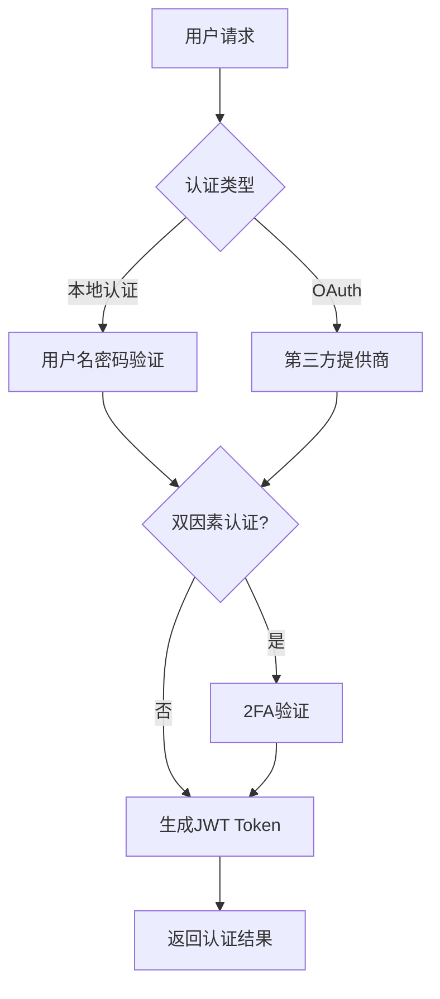

# 认证安全

## 概述

Blinko采用多层次的安全架构，包括JWT认证、OAuth集成、双因素认证、权限控制等机制，确保用户数据和系统的安全性。

## 认证系统架构

### 核心认证流程



### 认证策略

#### 1. JWT策略 (主要认证方式)

```typescript
// JWT Token生成
const genToken = async ({ id, name, role, permissions }) => {
  const secret = await getNextAuthSecret();
  return jwt.sign(
    {
      role,
      name,
      sub: id.toString(),
      exp: Math.floor(Date.now() / 1000) + (60 * 60 * 24 * 365 * 100),
      iat: Math.floor(Date.now() / 1000),
      permissions
    },
    secret
  );
};

// JWT验证
const verifyToken = async (token: string) => {
  const secret = await getNextAuthSecret();
  try {
    const decoded = jwt.verify(token, secret) as User;
    return decoded;
  } catch (error) {
    console.error('Token verification failed:', error);
    return null;
  }
};
```

**特性:**
- **长期有效期**: Token有效期长达100年，适合本地部署场景
- **自动续期**: 通过中间件自动验证和续期
- **权限控制**: Token包含用户角色和权限信息
- **安全加密**: 使用HS256算法签名

#### 2. Local策略 (用户名密码)

```typescript
passport.use(new LocalStrategy({
  usernameField: 'username',
  passwordField: 'password',
}, async (username, password, done) => {
  try {
    // 查找用户
    const users = await prisma.accounts.findMany({
      where: { name: username }
    });

    // 验证密码
    const user = users.find(u => 
      await verifyPassword(password, u.password ?? '')
    );

    if (!user) {
      return done(null, false, { message: 'Incorrect password' });
    }

    // 检查2FA
    const config = await getGlobalConfig({ ctx: userContext });
    if (config.twoFactorEnabled) {
      return done(null, false, { 
        requiresTwoFactor: true, 
        userId: user.id 
      });
    }

    const token = await generateToken(user, false);
    return done(null, { ...user, token });
  } catch (error) {
    return done(error);
  }
}));
```

**安全特性:**
- **密码哈希**: 使用bcrypt加密存储密码
- **缓存优化**: 用户数据缓存20秒减少数据库查询
- **2FA集成**: 自动检查双因素认证需求

#### 3. OAuth策略 (第三方认证)

支持多种OAuth提供商:

```typescript
// 支持的OAuth提供商
const SUPPORTED_PROVIDERS = [
  'github', 'google', 'facebook', 'twitter', 'discord',
  'spotify', 'apple', 'slack', 'twitch', 'line'
];

// OAuth回调处理
async function handleOAuthCallback(accessToken, refreshToken, profile, done) {
  try {
    let userName = profile.username || profile.displayName || profile.id.toString();

    let existingUser = await prisma.accounts.findFirst({
      where: {
        name: userName,
        loginType: 'oauth'
      }
    });

    if (!existingUser) {
      // 创建新用户
      const newUser = await prisma.accounts.create({
        data: {
          name: userName,
          nickname: userName,
          image: profile.photos?.[0]?.value || '',
          role: 'user',
          loginType: 'oauth',
        }
      });

      const token = await generateToken(newUser, false);
      return done(null, { ...newUser, token });
    } else {
      // 现有用户登录
      const config = await getGlobalConfig({ ctx: userContext });
      
      if (config.twoFactorEnabled) {
        return done(null, false, { 
          requiresTwoFactor: true, 
          userId: existingUser.id 
        });
      }

      const token = await generateToken(existingUser, false);
      return done(null, { ...existingUser, token });
    }
  } catch (error) {
    return done(error);
  }
}
```

**OAuth特性:**
- **自定义提供商**: 支持OpenID Connect自定义OAuth提供商
- **用户映射**: 自动映射OAuth用户信息到本地用户
- **账户关联**: 支持关联账户功能
- **图片同步**: 自动同步用户头像

## 双因素认证 (2FA)

### TOTP实现

```typescript
// 生成2FA密钥
export function generateTOTP(): string {
  return authenticator.generateSecret();
}

// 生成QR码URI
export function generateTOTPQRCode(username: string, secret: string): string {
  return authenticator.keyuri(username, 'Blinko', secret);
}

// 验证TOTP令牌
export function verifyTOTP(token: string, secret: string): boolean {
  try {
    return authenticator.verify({ token, secret });
  } catch (err) {
    return false;
  }
}
```

### 2FA验证流程

```typescript
// 2FA验证API
router.post('/verify-2fa', async (req, res) => {
  try {
    const userId = req.body.userId;
    const code = req.body.code;

    // 获取用户配置
    const user = await prisma.accounts.findUnique({
      where: { id: Number(userId) }
    });

    const config = await getGlobalConfig({
      ctx: { id: user.id.toString(), role: user.role, ... }
    });

    // 验证TOTP令牌
    const isValidToken = authenticator.verify({
      token: code,
      secret: config.twoFactorSecret ?? ''
    });

    if (!isValidToken) {
      return res.status(401).json({ 
        error: 'Invalid verification code' 
      });
    }

    // 生成带2FA验证标记的Token
    const token = await generateToken(user, true);

    return res.json({
      user: {
        id: user.id,
        name: user.name,
        role: user.role,
        nickname: user.nickname,
        image: user.image,
      },
      token,
    });
  } catch (error) {
    return res.status(500).json({ 
      error: 'Verification failed' 
    });
  }
});
```

**2FA特性:**
- **标准TOTP**: 兼容Google Authenticator、Authy等应用
- **QR码生成**: 便于用户设置
- **强制验证**: 可配置强制启用2FA
- **令牌验证**: 集成到JWT中标记2FA状态

## 权限控制系统

### 角色定义

```typescript
enum UserRole {
  SUPERADMIN = 'superadmin',  // 超级管理员
  USER = 'user'               // 普通用户
}

interface User extends jwt.JwtPayload {
  name: string;
  sub: string;
  role: string;
  id: string;
  exp: number;
  iat: number;
  permissions?: string[];      // 细粒度权限
  twoFactorVerified?: boolean; // 2FA验证状态
}
```

### 中间件权限控制

#### 1. 基础认证中间件

```typescript
export const authProcedure = t.procedure.use(async ({ ctx, next, path }) => {
  // 检查用户认证状态
  if (!ctx?.name || ctx?.requiresTwoFactor) {
    throw new TRPCError({
      code: "UNAUTHORIZED",
      message: 'Unauthorized'
    });
  }

  // 细粒度权限检查
  if (ctx.permissions && Array.isArray(ctx.permissions)) {
    const hasPermission = ctx.permissions.some(perm => 
      path?.includes(perm)
    );
    if (!hasPermission) {
      throw new TRPCError({
        code: "FORBIDDEN",
        message: 'This token does not have permission to access this endpoint'
      });
    }
  }

  return next({
    ctx,
    ...{ id: ctx.sub }
  });
});
```

#### 2. 超级管理员中间件

```typescript
export const superAdminAuthMiddleware = t.middleware(async ({ ctx, next }) => {
  if (ctx.role !== 'superadmin') {
    throw new TRPCError({
      code: "FORBIDDEN",
      message: 'You are not allowed to perform this operation'
    });
  }
  return next({ ctx });
});
```

#### 3. 演示环境限制中间件

```typescript
export const demoAuthMiddleware = t.middleware(async ({ ctx, next }) => {
  if (process.env.IS_DEMO) {
    throw new TRPCError({
      code: "FORBIDDEN",
      message: 'The operation is rejected because this is a demo environment'
    });
  }
  return next({ ctx });
});
```

### 权限令牌系统

```typescript
// 生成低权限令牌
genLowPermToken: authProcedure
  .mutation(async ({ ctx }) => {
    const user = await prisma.accounts.findFirst({ 
      where: { id: Number(ctx.id) } 
    });

    const token = await genToken({
      id: user.id,
      name: user.name ?? '',
      role: user.role,
      permissions: ['notes.upsert', 'ai.completions'] // 限制权限
    });

    return { token };
  })
```

**权限特性:**
- **角色继承**: 超级管理员拥有所有权限
- **细粒度控制**: 支持API级别的权限控制
- **临时权限**: 可生成限制权限的临时令牌
- **中间件链**: 可组合多个权限中间件

## 安全防护机制

### 1. 请求安全

#### CORS配置

```typescript
app.use(cors({
  origin: true,        // 允许所有来源 (生产环境应限制)
  credentials: true    // 允许携带凭证
}));

// 文件上传CORS
router.options('/', cors({
  origin: '*',
  methods: ['GET', 'POST', 'PUT', 'DELETE', 'OPTIONS'],
  allowedHeaders: '*',
  maxAge: 86400,
}));
```

#### 请求验证

```typescript
// Token提取和验证
export const getTokenFromRequest = async (req: ExpressRequest) => {
  try {
    if (req.headers && typeof req.headers === 'object') {
      const authHeader = req.headers.authorization;
      if (authHeader && authHeader.startsWith('Bearer ')) {
        const token = authHeader.substring(7);
        const tokenData = await verifyToken(token);
        
        if (tokenData) {
          return {
            id: tokenData.sub,
            name: tokenData.name,
            role: tokenData.role,
            // 添加请求元信息
            ip: req.ip,
            userAgent: req.headers['user-agent']
          };
        }
      }
    }
    return null;
  } catch (error) {
    console.error('Token extraction failed:', error);
    return null;
  }
};
```

### 2. 文件访问安全

```typescript
// 文件权限检查
const token = await getTokenFromRequest(req);

if (fullPath.includes('/')) {
  try {
    const myFile = await prisma.attachments.findFirst({
      where: { path: `/${fullPath}` },
      include: { note: true }
    });

    // 检查文件访问权限
    if (myFile && !myFile?.note?.isShare && 
        Number(token?.id) != myFile?.note?.accountId && 
        !myFile?.accountId) {
      return res.status(401).json({ error: "Unauthorized" });
    }
  } catch (error) {
    return res.status(500).json({ 
      error: "Error checking file permissions" 
    });
  }
}

// 备份文件保护
if (fullPath.endsWith('.bko') && token?.role !== 'superadmin') {
  return res.status(401).json({ 
    error: "Only superadmin can access" 
  });
}
```

### 3. 输入验证与清理

```typescript
// 路径安全化
const sanitizedPath = fullPath.replace(/^[./\\]+/, '');
const filePath = path.join(UPLOAD_FILE_PATH, sanitizedPath);

// 文件名编码
const encodedFilename = encodeURIComponent(fullPath)
  .replace(/['()]/g, (char) => 
    '%' + char.charCodeAt(0).toString(16)
  );
```

### 4. 错误处理安全

```typescript
// 安全的错误响应
if (!response.ok) {
  return res.status(404).json({
    error: 'File not found',
    details: process.env.NODE_ENV === 'development' 
      ? error.message 
      : undefined  // 生产环境隐藏详细错误
  });
}
```

## 密码安全

### 密码哈希

```typescript
// 使用bcrypt进行密码哈希
import { hashPassword, verifyPassword } from '@prisma/seed';

// 注册时哈希密码
const passwordHash = await hashPassword(password);
const user = await prisma.accounts.create({
  data: {
    name,
    password: passwordHash,
    // ...
  }
});

// 登录时验证密码
const isValid = await verifyPassword(password, user.password ?? '');
```

### 密码策略

- **最小长度**: 前端建议最小密码长度
- **哈希算法**: 使用bcrypt加盐哈希
- **密码重置**: 通过管理员重置机制
- **密码更新**: 需要原密码验证

## 会话管理

### JWT会话

```typescript
// JWT密钥管理
export const getNextAuthSecret = async () => {
  const configKey = 'JWT_SECRET';
  let secret = process.env.JWT_SECRET;
  
  if (!secret || secret === 'my_ultra_secure_nextauth_secret') {
    const savedSecret = await prisma.config.findFirst({
      where: { key: configKey }
    });
    
    if (savedSecret) {
      secret = savedSecret.config.value as string;
    } else {
      // 生成新的随机密钥
      const newSecret = crypto.randomBytes(32).toString('base64');
      await prisma.config.create({
        data: {
          key: configKey,
          config: { value: newSecret }
        }
      });
      secret = newSecret;
    }
  }
  return secret;
};
```

### 缓存安全

```typescript
// 用户缓存管理
const CACHE_TTL = 20 * 1000; // 20秒TTL

const user = await cache.wrap(`user_by_id_${jwtPayload.sub}`, async () => {
  return await prisma.accounts.findUnique({
    where: { id: Number(jwtPayload.sub) },
  });
}, { ttl: CACHE_TTL });

// 缓存失效
cache.set(`user_by_id_${user.id}`, null);
```

**会话特性:**
- **无状态设计**: JWT实现无状态会话
- **自动密钥管理**: 动态生成和存储JWT密钥
- **缓存优化**: 用户信息缓存减少数据库查询
- **安全失效**: 支持立即失效缓存

## 安全配置

### 环境变量安全

```bash
# JWT密钥
JWT_SECRET=your_super_secure_jwt_secret

# 数据库连接
DATABASE_URL=postgresql://...

# 演示模式
IS_DEMO=false

# 信任代理
TRUST_PROXY=1
```

### 生产环境建议

#### 1. HTTPS强制

```nginx
# Nginx配置示例
server {
    listen 80;
    return 301 https://$server_name$request_uri;
}

server {
    listen 443 ssl http2;
    ssl_certificate /path/to/cert.pem;
    ssl_certificate_key /path/to/key.pem;
    
    # 安全头
    add_header Strict-Transport-Security "max-age=31536000; includeSubDomains" always;
    add_header X-Frame-Options DENY always;
    add_header X-Content-Type-Options nosniff always;
}
```

#### 2. 防火墙配置

```bash
# 仅允许必要端口
ufw allow 22    # SSH
ufw allow 80    # HTTP
ufw allow 443   # HTTPS
ufw enable
```

#### 3. 代理配置

```typescript
// 信任代理设置
if (process.env.TRUST_PROXY === '1') {
  app.set('trust proxy', 1);
}
```

#### 4. 限流配置

```typescript
// 可添加rate limiting中间件
const rateLimit = require('express-rate-limit');

const limiter = rateLimit({
  windowMs: 15 * 60 * 1000, // 15分钟
  max: 100 // 限制每个IP 100次请求
});

app.use('/api/', limiter);
```

## 安全审计

### 日志记录

```typescript
// 认证日志
console.log('OAuth认证成功, 用户:', user.id);
console.log('Login successful:', { user: user.id });
console.log('2FA verification successful:', { user: user.id });

// 错误日志
console.error('Token verification failed:', error);
console.error('OAuth authentication error:', err);
console.error('2FA verification error:', error);
```

### 安全监控

- **失败登录**: 监控登录失败次数
- **Token滥用**: 监控异常Token使用
- **权限越权**: 监控权限违规访问
- **文件访问**: 监控敏感文件访问

### 安全检查清单

#### 认证安全
- [ ] JWT密钥足够复杂且定期轮换
- [ ] 密码使用强哈希算法存储
- [ ] 2FA在关键账户上启用
- [ ] OAuth配置安全且限制scope

#### 授权安全
- [ ] 实施最小权限原则
- [ ] 定期审查用户权限
- [ ] 敏感操作需要额外验证
- [ ] 管理员权限分离

#### 传输安全
- [ ] 强制使用HTTPS
- [ ] 配置安全HTTP头
- [ ] 验证SSL证书有效性
- [ ] 禁用不安全的协议版本

#### 存储安全
- [ ] 数据库连接加密
- [ ] 敏感配置加密存储
- [ ] 定期备份和恢复测试
- [ ] 文件权限正确设置

## 最佳实践

### 1. 认证最佳实践

- **多因素认证**: 对管理员账户强制启用2FA
- **密码策略**: 实施强密码要求
- **会话管理**: 合理设置Token过期时间
- **登录限制**: 实施登录尝试限制

### 2. 权限最佳实践

- **最小权限**: 仅授予必要的最小权限
- **权限审计**: 定期审查用户权限
- **角色分离**: 避免权限过度集中
- **临时权限**: 使用临时令牌限制API访问

### 3. 数据保护最佳实践

- **数据加密**: 敏感数据传输和存储加密
- **访问控制**: 严格控制数据访问权限
- **数据备份**: 定期备份重要数据
- **数据清理**: 定期清理过期和无用数据

### 4. 运维安全最佳实践

- **系统更新**: 及时更新系统和依赖
- **安全监控**: 实施全面的安全监控
- **事件响应**: 建立安全事件响应流程
- **安全培训**: 定期进行安全意识培训

Blinko的安全架构提供了全面的保护机制，从认证授权到数据保护，确保用户数据和系统的安全性。通过合理配置和持续监控，可以构建一个安全可靠的知识管理环境。
