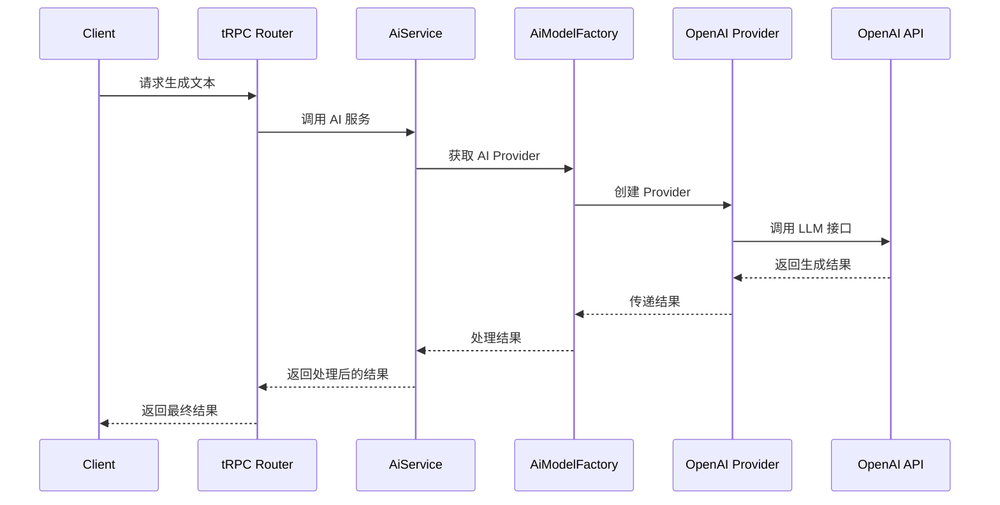
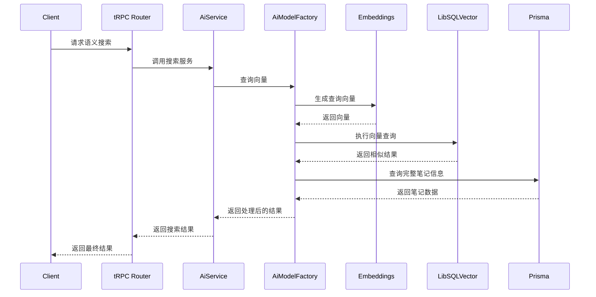

# AI 架构概述

## 1. AI 系统整体架构

Blinko 的 AI 系统采用模块化、可插拔的架构设计，核心由 `aiModelFactory` 工厂类和各种 AI 提供者组成。整个系统支持多种 AI 模型，包括 OpenAI、Azure OpenAI、Ollama、Anthropic 等，同时通过向量数据库实现高效的语义搜索功能。

```
┌─────────────────────────────────────────────────────────────────┐
│                     Blinko AI 系统架构                          │
├─────────────────────────────────────────────────────────────────┤
│  客户端 API 层                                                  │
│  ┌─────────────────────────────────────────────────────────────┐ │
│  │                   tRPC AI 路由                              │ │
│  └─────────────────────────────────────────────────────────────┘ │
├─────────────────────────────────────────────────────────────────┤
│  AI 服务层                                                      │
│  ┌─────────────┐  ┌─────────────┐  ┌─────────────┐             │
│  │ AiService   │  │ AiModel     │  │ Embedding   │             │
│  │ 核心服务     │  │ Factory     │  │ Service     │             │
│  └─────────────┘  └─────────────┘  └─────────────┘             │
├─────────────────────────────────────────────────────────────────┤
│  AI 提供者层                                                    │
│  ┌─────────────┐  ┌─────────────┐  ┌─────────────┐  ┌─────────┐ │
│  │ OpenAI      │  │ Azure       │  │ Ollama      │  │ 其他     │ │
│  │ Provider    │  │ Provider    │  │ Provider    │  │ Provider │ │
│  └─────────────┘  └─────────────┘  └─────────────┘  └─────────┘ │
├─────────────────────────────────────────────────────────────────┤
│  向量存储层                                                     │
│  ┌─────────────────────────────────────────────────────────────┐ │
│  │             LibSQLVector / PgVector                         │ │
│  └─────────────────────────────────────────────────────────────┘ │
└─────────────────────────────────────────────────────────────────┘
```

## 2. 核心组件详解

### 2.1 AiModelFactory

`AiModelFactory` 是整个 AI 系统的核心，负责创建和管理 AI 提供者实例，并提供统一的接口进行模型调用。该类采用工厂模式设计，根据配置动态创建不同的 AI 提供者。

**核心功能**：
- 根据配置创建 AI 提供者实例
- 管理向量数据库连接
- 提供向量搜索功能
- 管理嵌入模型和维度

**代码结构**：
```typescript
// server/aiServer/aiModelFactory.ts
export class AiModelFactory {
  // 创建 Provider 的核心方法
  static async GetProvider() {
    const globalConfig = await AiModelFactory.ValidConfig();
    
    // 根据配置选择不同的 AI 提供者
    switch (globalConfig.aiModelProvider) {
      case 'OpenAI':
        return createProviderResult(new OpenAIModelProvider({ globalConfig }));
      case 'AzureOpenAI':
        return createProviderResult(new AzureOpenAIModelProvider({ globalConfig }));
      case 'Ollama':
        return createProviderResult(new OllamaModelProvider({ globalConfig }));
      // 其他提供者...
    }
  }
  
  // 查询向量数据
  static async queryVector(query: string, accountId: number) {
    const { VectorStore, Embeddings } = await AiModelFactory.GetProvider();
    
    // 生成查询向量
    const { embedding } = await embed({
      value: query,
      model: Embeddings,
    });
    
    // 向量相似度搜索
    const result = await VectorStore.query({
      indexName: 'blinko',
      queryVector: embedding,
      topK: topK,
    });
    
    // 处理搜索结果...
  }
  
  // 重建向量索引
  static async rebuildVectorIndex({ vectorStore, isDelete = false }) {
    // 创建或重建向量索引的实现...
  }
}
```

### 2.2 AI 提供者基类

所有 AI 提供者都继承自 `AiBaseModelProvider` 基类，该类定义了统一的接口和基本功能。

**核心接口**：
```typescript
// server/aiServer/providers/index.ts
export abstract class AiBaseModelProvider {
  // 共享配置
  globalConfig: GlobalConfig;
  provider!: ProviderV1;
  
  // 创建具体的提供者实例
  protected abstract createProvider(): ProviderV1;
  
  // 获取语言模型
  protected abstract getLLM(): LanguageModelV1;
  
  // 获取嵌入模型
  async Embeddings(): Promise<EmbeddingModelV1<string>> {
    // 实现获取嵌入模型的逻辑
  }
  
  // 获取向量存储
  public async VectorStore(): Promise<LibSQLVector> {
    // 实现向量存储连接
  }
}
```

### 2.3 向量存储实现

Blinko 使用 LibSQLVector 作为向量存储引擎，支持高效的向量搜索功能。

**核心实现**：
```typescript
// server/aiServer/vector/index.ts
export class LibSQLVector extends MastraVector {
  // 向量查询
  async query(params): Promise<QueryResult[]> {
    // 构建向量查询 SQL
    const query = `
      WITH vector_scores AS (
        SELECT
          vector_id as id,
          (1-vector_distance_cos(embedding, '${vectorStr}')) as score,
          metadata
          ${includeVector ? ', vector_extract(embedding) as embedding' : ''}
        FROM ${indexName}
        ${filterQuery}
      )
      SELECT *
      FROM vector_scores
      WHERE score > ?
      ORDER BY score DESC
      LIMIT ${topK}`;
      
    // 执行查询...
  }
  
  // 向量更新
  async upsert(params): Promise<string[]> {
    // 实现向量更新逻辑...
  }
  
  // 创建索引
  async createIndex(params): Promise<void> {
    // 创建向量索引...
  }
}
```

## 3. AI 功能流程

### 3.1 文本生成流程



### 3.2 向量搜索流程



## 4. 支持的 AI 模型

Blinko 目前支持以下 AI 提供者：

| 提供者 | 支持功能 | 实现文件 |
|--------|---------|---------|
| OpenAI | 文本生成、嵌入 | `server/aiServer/providers/openAI.ts` |
| Azure OpenAI | 文本生成、嵌入 | `server/aiServer/providers/azureOpenAI.ts` |
| Ollama | 文本生成、嵌入 | `server/aiServer/providers/ollama.ts` |
| Anthropic | 文本生成 | `server/aiServer/providers/anthropic.ts` |
| Deepseek | 文本生成 | `server/aiServer/providers/deepseek.ts` |
| Gemini | 文本生成 | `server/aiServer/providers/gemini.ts` |
| Voyage | 嵌入 | `server/aiServer/providers/voyage.ts` |

## 5. 配置与扩展

### 5.1 添加新 AI 提供者

要添加新的 AI 提供者，需要：

1. 创建新的提供者类，继承 `AiBaseModelProvider`
2. 实现 `createProvider()` 和 `getLLM()` 方法
3. 在 `AiModelFactory.GetProvider()` 中添加新的 case 分支

```typescript
// 新提供者示例
export class NewAIProvider extends AiBaseModelProvider {
  protected createProvider(): ProviderV1 {
    // 实现 Provider 创建
  }
  
  protected getLLM(): LanguageModelV1 {
    // 实现 LLM 获取
  }
}

// 在 AiModelFactory 中添加
case 'NewAI':
  return createProviderResult(new NewAIProvider({ globalConfig }));
```

### 5.2 全局配置项

AI 系统的配置项包括：

```typescript
interface AIConfig {
  // 基本配置
  aiModelProvider: string;     // AI 提供者类型
  aiModel: string;             // 语言模型名称
  aiApiKey: string;            // API 密钥
  aiApiEndpoint?: string;      // 自定义 API 端点
  
  // 嵌入配置
  embeddingModel: string;      // 嵌入模型名称
  embeddingDimensions?: number; // 嵌入维度
  embeddingTopK?: number;      // 检索数量
  embeddingScore?: number;     // 相似度阈值
  
  // 代理配置
  isUseHttpProxy: boolean;     // 是否使用代理
  httpProxyHost?: string;      // 代理主机
  httpProxyPort?: number;      // 代理端口
}
```

这些配置项存储在数据库的 `config` 表中，通过 `getGlobalConfig` 函数获取。

## 6. 下一步阅读

- [向量嵌入详解](02-向量嵌入详解.md) - 了解向量嵌入的实现和优化
- [RAG系统实现](03-RAG系统实现.md) - 探索检索增强生成系统的细节
- [AI工具与Agent](04-AI工具与Agent.md) - 了解 AI 工具和 Agent 的设计与实现
- [模型集成指南](05-模型集成指南.md) - 学习如何集成新的 AI 模型 