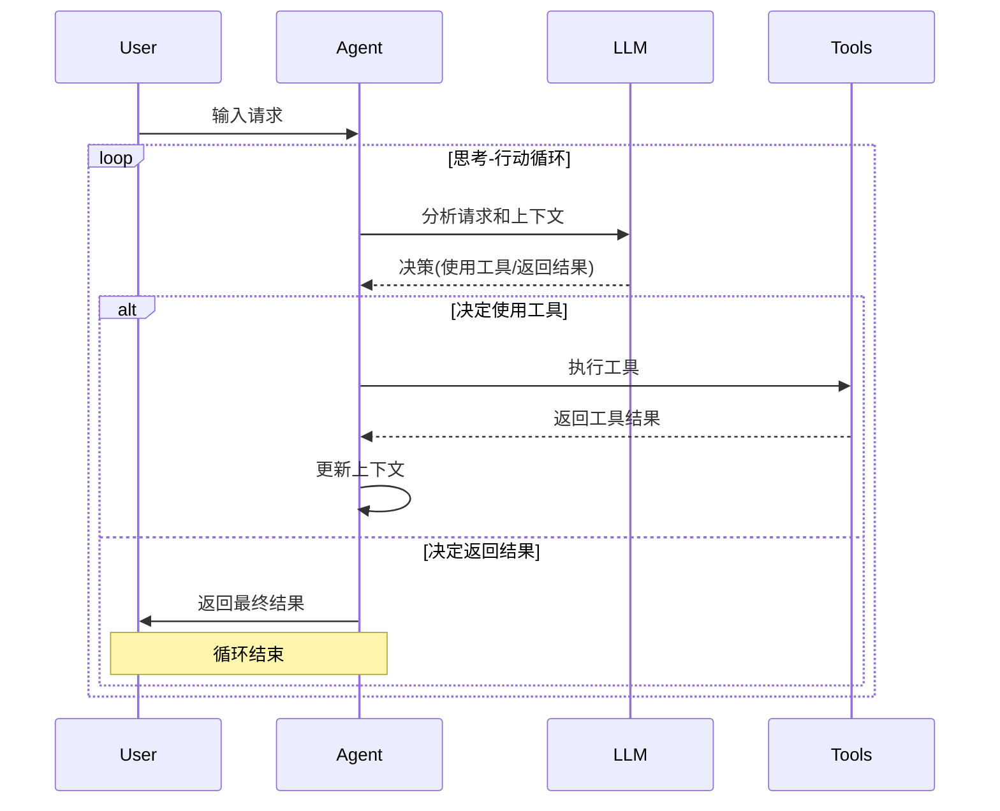

# AI 工具与 Agent

## 1. Agent 系统概述

Blinko 的 AI Agent 系统提供了一种智能的、基于工具的交互方式，使 AI 能够执行更复杂的任务。Agent 可以根据用户需求分析问题、规划步骤、使用各种工具，并最终返回结果。本文详细介绍 Blinko 中 Agent 系统的实现和应用。

## 2. Agent 基础架构

### 2.1 Agent 核心组件

```typescript
// 基于 Mastra 的 Agent 实现
class Agent {
  private llm: LanguageModelV1;
  private tools: Tool[];
  private systemPrompt: string;
  private memory: Memory;
  
  constructor({ llm, systemPrompt, memory = new SimpleMemory() }) {
    this.llm = llm;
    this.systemPrompt = systemPrompt;
    this.tools = [];
    this.memory = memory;
  }
  
  // 添加工具
  addTool(tool: Tool) {
    this.tools.push(tool);
  }
  
  // 执行 Agent
  async run(input: string, params: any = {}) {
    // 构建初始上下文
    const context = this.buildInitialContext(input);
    
    // 运行思考-行动循环
    return this.runThinkActLoop(context, params);
  }
  
  // 思考-行动循环
  private async runThinkActLoop(context: AgentContext, params: any) {
    // 最大尝试次数
    const maxAttempts = params.maxAttempts || 10;
    let attempts = 0;
    
    while (attempts < maxAttempts) {
      // 思考阶段 - 让 LLM 决定下一步行动
      const thinking = await this.think(context);
      
      // 行动阶段 - 执行选定的工具
      const action = this.decideAction(thinking);
      if (!action) {
        // 如果没有行动，返回最终答案
        return { output: thinking.answer, steps: context.steps };
      }
      
      // 执行工具并获取结果
      const result = await this.executeAction(action, params);
      
      // 更新上下文
      context.steps.push({ action, result });
      attempts++;
    }
    
    // 达到最大尝试次数
    return { output: "达到最大尝试次数，无法完成任务", steps: context.steps };
  }
}
```

### 2.2 Agent 工作流程



## 3. Agent 工厂实现

Blinko 使用工厂模式创建不同类型的 Agent：

```typescript
// server/aiServer/aiModelFactory.ts
export class AiModelFactory {
  // ...其他方法
  
  // 创建 Agent 的工厂方法
  static #createAgentFactory(
    name: string,
    systemPrompt: string,
    cacheKey: string,
    maxAttempts: number = 3
  ) {
    return async () => {
      const { LLM } = await AiModelFactory.GetProvider();
      
      // 使用缓存
      return cache.wrap(
        `${cacheKey}-Agent-${AiModelFactory.cacheProvider}`,
        async () => {
          // 创建 Agent 实例
          const agent = new Agent({
            llm: LLM,
            systemPrompt: systemPrompt,
            memory: new SimpleMemory()
          });
          
          // 返回配置好的 Agent
          return agent;
        }
      );
    };
  }

  // 基础聊天 Agent
  static async BaseChatAgent({ withTools = true, withOnlineSearch = false }) {
    const { LLM } = await AiModelFactory.GetProvider();
    
    // 创建基础 Agent
    const agent = new Agent({
      llm: LLM,
      systemPrompt: `你是 Blinko 的 AI 助手，你将帮助用户管理笔记和回答问题。`,
    });
    
    // 添加工具
    if (withTools) {
      agent.addTool(upsertBlinkoTool);
      agent.addTool(searchBlinkoTool);
      agent.addTool(updateBlinkoTool);
      agent.addTool(deleteBlinkoTool);
    }
    
    // 添加网络搜索功能
    if (withOnlineSearch) {
      agent.addTool(webSearchTool);
      agent.addTool(webExtra);
    }
    
    return agent;
  }
  
  // 专门用途的 Agent 实例
  static TagAgent = AiModelFactory.#createAgentFactory(
    'Blinko Tag Agent',
    `你是标签生成专家，你的任务是为笔记生成标签。
    根据笔记内容，提取 3-5 个最相关的关键词作为标签。
    标签应该简洁、相关、有助于内容分类。
    返回格式为逗号分隔的标签列表，如: "编程,JavaScript,React"`,
    'BlinkoTags'
  );
  
  static SummarizeAgent = AiModelFactory.#createAgentFactory(
    'Blinko Summarize Agent',
    `你是内容摘要专家，你的任务是为长文本生成简洁的摘要。
    摘要应该捕捉文本的主要观点和核心信息，长度控制在 100 字以内。`,
    'BlinkoSummarize'
  );
  
  static WebSearchAgent = AiModelFactory.#createAgentFactory(
    'Blinko Web Search Agent',
    `你是网络搜索专家，你的任务是帮助用户从网络上获取信息。
    你可以使用搜索工具查询最新信息，并提供简洁、准确的回答。`,
    'BlinkoWebSearch'
  );
}
```

## 4. 工具实现

### 4.1 工具接口

每个工具都遵循统一的接口：

```typescript
// server/aiServer/tools/types.ts
export interface Tool {
  name: string;                  // 工具名称
  description: string;           // 工具描述
  parameters: JSONSchema;        // 参数定义
  execute: ToolExecuteFunction;  // 执行函数
}

export type ToolExecuteFunction = (
  args: any,                      // 工具参数
  context: {                     // 执行上下文
    params: any;                 // 附加参数
    conversationId?: string;     // 对话 ID
    messageId?: string;          // 消息 ID
  }
) => Promise<any>;               // 执行结果
```

### 4.2 笔记搜索工具

```typescript
// server/aiServer/tools/searchBlinko.ts
export const searchBlinkoTool: Tool = {
  name: 'searchBlinko',
  description: '搜索用户的笔记内容，查找与查询相关的笔记',
  parameters: {
    type: 'object',
    properties: {
      query: {
        type: 'string',
        description: '搜索查询，用于查找用户笔记'
      }
    },
    required: ['query']
  },
  execute: async ({ query }, { params }) => {
    const { accountId } = params;
    
    // 使用向量搜索查找相关笔记
    const { notes } = await AiModelFactory.queryVector(query, accountId);
    
    // 格式化搜索结果
    const formattedResults = notes.map(note => ({
      id: note.id,
      title: note.title || note.content.substring(0, 50),
      content: note.content,
      createdAt: note.createdAt,
      updatedAt: note.updatedAt
    }));
    
    return formattedResults;
  }
};
```

### 4.3 创建笔记工具

```typescript
// server/aiServer/tools/upsertBlinko.ts
export const upsertBlinkoTool: Tool = {
  name: 'upsertBlinko',
  description: '创建或更新笔记',
  parameters: {
    type: 'object',
    properties: {
      title: {
        type: 'string',
        description: '笔记标题'
      },
      content: {
        type: 'string',
        description: '笔记内容 (Markdown 格式)'
      },
      id: {
        type: 'number',
        description: '笔记 ID (如果是更新现有笔记)'
      }
    },
    required: ['content']
  },
  execute: async ({ title, content, id }, { params }) => {
    const { accountId } = params;
    
    try {
      // 创建或更新笔记
      const note = await prisma.notes.upsert({
        where: {
          id: id ?? -1,
          accountId
        },
        update: {
          title,
          content
        },
        create: {
          title: title || '新笔记',
          content,
          accountId
        }
      });
      
      // 向量化新笔记
      await AiService.embeddingUpsert({
        id: note.id,
        content: note.content,
        type: id ? 'update' : 'create',
        createTime: note.createdAt
      });
      
      return { 
        success: true, 
        note: {
          id: note.id,
          title: note.title,
          preview: note.content.substring(0, 100)
        }
      };
    } catch (error) {
      return { success: false, error: error.message };
    }
  }
};
```

### 4.4 网络搜索工具

```typescript
// server/aiServer/tools/webSearch.ts
export const webSearchTool: Tool = {
  name: 'webSearch',
  description: '在网络上搜索最新信息',
  parameters: {
    type: 'object',
    properties: {
      query: {
        type: 'string',
        description: '搜索查询'
      }
    },
    required: ['query']
  },
  execute: async ({ query }) => {
    try {
      // 使用搜索 API 获取结果
      const results = await searchWebAPI(query);
      
      // 格式化搜索结果
      return results.map(result => ({
        title: result.title,
        snippet: result.snippet,
        url: result.url
      }));
    } catch (error) {
      return { error: '网络搜索失败: ' + error.message };
    }
  }
};
```

## 5. Agent 应用场景

### 5.1 智能标签生成

```typescript
// server/aiServer/index.ts
static async generateTags({ content, noteId }) {
  try {
    // 使用标签生成 Agent
    const agent = await AiModelFactory.TagAgent();
    
    // 运行 Agent 生成标签
    const result = await agent.run(content);
    
    // 解析生成的标签
    const tags = result.output
      .split(',')
      .map(tag => tag.trim())
      .filter(tag => tag.length > 0);
    
    // 保存标签到数据库
    if (noteId) {
      await Promise.all(tags.map(async (tagName) => {
        // 查找或创建标签
        const tag = await prisma.tag.upsert({
          where: { name_accountId: { name: tagName, accountId: (await prisma.notes.findUnique({ where: { id: noteId } })).accountId } },
          update: {},
          create: { 
            name: tagName, 
            accountId: (await prisma.notes.findUnique({ where: { id: noteId } })).accountId 
          }
        });
        
        // 关联标签到笔记
        await prisma.tagsToNote.upsert({
          where: { noteId_tagId: { noteId, tagId: tag.id } },
          update: {},
          create: { noteId, tagId: tag.id }
        });
      }));
    }
    
    return { ok: true, tags };
  } catch (error) {
    console.error('标签生成失败:', error);
    return { ok: false, error: error.message };
  }
}
```

### 5.2 内容摘要生成

```typescript
// server/aiServer/index.ts
static async generateSummary({ content, maxLength = 150 }) {
  try {
    // 使用摘要生成 Agent
    const agent = await AiModelFactory.SummarizeAgent();
    
    // 构建包含长度限制的提示
    const prompt = `请为以下内容生成一个不超过 ${maxLength} 字的摘要：\n\n${content}`;
    
    // 运行 Agent 生成摘要
    const result = await agent.run(prompt);
    
    return { 
      ok: true, 
      summary: result.output 
    };
  } catch (error) {
    console.error('摘要生成失败:', error);
    return { ok: false, error: error.message };
  }
}
```

### 5.3 网络增强问答

```typescript
// server/aiServer/index.ts
static async webEnhancedAnswer({ query, accountId }) {
  try {
    // 创建带网络搜索功能的 Agent
    const agent = await AiModelFactory.BaseChatAgent({ 
      withTools: true, 
      withOnlineSearch: true 
    });
    
    // 设置执行参数
    const params = { accountId };
    
    // 运行 Agent 回答问题
    const result = await agent.run(query, params);
    
    return { 
      ok: true, 
      answer: result.output,
      steps: result.steps 
    };
  } catch (error) {
    console.error('网络增强问答失败:', error);
    return { ok: false, error: error.message };
  }
}
```

## 6. 记忆与上下文管理

### 6.1 记忆接口

```typescript
// server/aiServer/memory/types.ts
export interface Memory {
  // 添加消息到记忆
  addMessage(message: Message): void;
  
  // 获取当前记忆中的所有消息
  getMessages(): Message[];
  
  // 清空记忆
  clear(): void;
  
  // 将记忆格式化为上下文
  formatForContext(): string;
}

export interface Message {
  role: 'user' | 'assistant' | 'system';
  content: string;
  timestamp?: number;
}
```

### 6.2 简单记忆实现

```typescript
// server/aiServer/memory/simpleMemory.ts
export class SimpleMemory implements Memory {
  private messages: Message[] = [];
  private maxMessages: number;
  
  constructor(maxMessages: number = 10) {
    this.maxMessages = maxMessages;
  }
  
  addMessage(message: Message): void {
    // 添加时间戳
    const messageWithTimestamp = {
      ...message,
      timestamp: message.timestamp || Date.now()
    };
    
    this.messages.push(messageWithTimestamp);
    
    // 限制消息数量
    if (this.messages.length > this.maxMessages) {
      // 保留系统消息和最新的消息
      const systemMessages = this.messages.filter(msg => msg.role === 'system');
      const nonSystemMessages = this.messages
        .filter(msg => msg.role !== 'system')
        .slice(-this.maxMessages + systemMessages.length);
      
      this.messages = [...systemMessages, ...nonSystemMessages];
    }
  }
  
  getMessages(): Message[] {
    return [...this.messages];
  }
  
  clear(): void {
    // 清空非系统消息
    this.messages = this.messages.filter(msg => msg.role === 'system');
  }
  
  formatForContext(): string {
    // 将消息格式化为上下文文本
    return this.messages
      .map(msg => `${msg.role.toUpperCase()}: ${msg.content}`)
      .join('\n\n');
  }
}
```

### 6.3 记忆管理

```typescript
// 使用记忆维护对话上下文
class ConversationManager {
  private conversations: Map<string, SimpleMemory> = new Map();
  
  // 获取对话记忆
  getMemory(conversationId: string): SimpleMemory {
    if (!this.conversations.has(conversationId)) {
      this.conversations.set(conversationId, new SimpleMemory());
    }
    return this.conversations.get(conversationId);
  }
  
  // 添加消息到对话
  addMessage(conversationId: string, message: Message): void {
    const memory = this.getMemory(conversationId);
    memory.addMessage(message);
  }
  
  // 获取对话历史
  getConversationHistory(conversationId: string): Message[] {
    return this.getMemory(conversationId).getMessages();
  }
  
  // 清除过期的对话
  cleanup(maxAgeMs: number = 24 * 60 * 60 * 1000): void {
    const now = Date.now();
    
    for (const [id, memory] of this.conversations.entries()) {
      const messages = memory.getMessages();
      const lastMessageTime = Math.max(...messages.map(m => m.timestamp || 0));
      
      if (now - lastMessageTime > maxAgeMs) {
        this.conversations.delete(id);
      }
    }
  }
}
```

## 7. 工具链功能

### 7.1 工具链定义

```typescript
// 工具链接口
interface ToolChain {
  name: string;
  description: string;
  tools: Tool[];
  execute(input: any, context: any): Promise<any>;
}

// 工具链实现
class SequentialToolChain implements ToolChain {
  name: string;
  description: string;
  tools: Tool[];
  
  constructor(name: string, description: string, tools: Tool[]) {
    this.name = name;
    this.description = description;
    this.tools = tools;
  }
  
  // 按顺序执行工具
  async execute(input: any, context: any): Promise<any> {
    let currentInput = input;
    const results = [];
    
    for (const tool of this.tools) {
      // 执行当前工具
      const result = await tool.execute(currentInput, context);
      results.push({ tool: tool.name, result });
      
      // 结果作为下一个工具的输入
      currentInput = result;
    }
    
    return {
      finalResult: results[results.length - 1].result,
      steps: results
    };
  }
}
```

### 7.2 内容处理工具链

```typescript
// 内容处理工具链示例
const contentProcessingChain = new SequentialToolChain(
  'contentProcessingChain',
  '处理笔记内容的工具链，包括摘要、标签和相关笔记推荐',
  [
    // 摘要生成工具
    {
      name: 'summarizeTool',
      description: '生成内容摘要',
      parameters: { type: 'object', properties: { content: { type: 'string' } } },
      execute: async ({ content }) => {
        const { summary } = await AiService.generateSummary({ content });
        return { content, summary };
      }
    },
    
    // 标签生成工具
    {
      name: 'tagGenerationTool',
      description: '生成内容标签',
      parameters: { type: 'object', properties: { content: { type: 'string' } } },
      execute: async ({ content, summary }) => {
        const { tags } = await AiService.generateTags({ content });
        return { content, summary, tags };
      }
    },
    
    // 相关笔记推荐工具
    {
      name: 'relatedNotesTool',
      description: '推荐相关笔记',
      parameters: { type: 'object', properties: { content: { type: 'string' } } },
      execute: async ({ content, summary, tags }, { params }) => {
        const { notes } = await AiModelFactory.queryVector(content, params.accountId, 3);
        return { content, summary, tags, relatedNotes: notes };
      }
    }
  ]
);
```

## 8. Agent 优化策略

### 8.1 提示词工程

Agent 系统的核心在于精心设计的提示词：

```typescript
// 高效的 Agent 提示词模板
const agentPromptTemplate = `
你是 Blinko 的 AI 助手，你的任务是：{{taskDescription}}

你可以使用以下工具：
{{toolDescriptions}}

使用工具时，请遵循以下步骤：
1. 分析用户请求，确定需要使用的工具
2. 准备工具所需的参数
3. 使用工具并分析结果
4. 如果需要，使用另一个工具继续
5. 当任务完成时，提供最终答案

示例格式：
思考：我需要先了解用户的笔记内容，然后...
行动：{"tool": "searchBlinko", "parameters": {"query": "项目计划"}}
结果：[工具返回的结果]
思考：现在我了解了用户的笔记，我将...
行动：{"tool": "upsertBlinko", "parameters": {"title": "总结", "content": "..."}}
最终答案：我已经为您创建了一个总结笔记...

开始解决用户的请求：{{userRequest}}
`;
```

### 8.2 思考链推理

为了提高 Agent 的推理能力，Blinko 实现了思考链 (Chain-of-Thought) 推理：

```typescript
// 思考链推理实现
function buildAgentPromptWithCoT(systemPrompt: string, userRequest: string, tools: Tool[]): string {
  // 构建工具描述
  const toolDescriptions = tools.map(tool => {
    const paramsDescription = Object.entries(tool.parameters.properties)
      .map(([name, prop]) => `- ${name}: ${prop.description}`)
      .join('\n');
    
    return `
工具名称: ${tool.name}
描述: ${tool.description}
参数:
${paramsDescription}
`;
  }).join('\n');
  
  // 构建完整提示词
  return `${systemPrompt}

你可以使用以下工具:
${toolDescriptions}

解决问题时，请按以下格式进行思考和行动:
思考: [分析问题并决定使用哪个工具]
行动: [使用 JSON 格式指定工具和参数]
结果: [工具返回的结果]
思考: [分析结果并决定下一步]
...
最终答案: [给用户的最终回答]

请逐步思考问题，明确说明你的推理过程，然后再采取行动。
如果不需要使用工具，直接给出最终答案。

用户请求: ${userRequest}

思考:`;
}
```

### 8.3 错误处理与恢复

Blinko 的 Agent 系统实现了健壮的错误处理和恢复机制：

```typescript
// Agent 错误处理与恢复
private async executeAction(action: AgentAction, params: any): Promise<any> {
  const { tool, parameters } = action;
  
  try {
    // 查找工具
    const toolImpl = this.tools.find(t => t.name === tool);
    if (!toolImpl) {
      return { error: `未找到工具: ${tool}` };
    }
    
    // 执行工具
    return await toolImpl.execute(parameters, { params });
  } catch (error) {
    // 错误处理
    console.error(`执行工具 ${tool} 失败:`, error);
    
    // 恢复策略
    if (error.retryable) {
      // 可重试错误
      return { 
        error: `工具执行暂时失败: ${error.message}`,
        suggestion: "可以稍后重试或使用替代工具" 
      };
    } else {
      // 不可恢复错误
      return { 
        error: `工具执行失败: ${error.message}`,
        suggestion: "请尝试使用不同的方法解决问题" 
      };
    }
  }
}
```

## 9. 自定义工具开发

### 9.1 工具创建流程

开发新工具的标准流程：

1. **定义工具接口**：确定工具名称、描述、参数和功能
2. **实现执行函数**：编写工具的核心逻辑
3. **集成到 Agent**：将工具添加到 Agent 中
4. **测试与优化**：测试工具功能并优化性能

### 9.2 自定义工具示例

```typescript
// 自定义笔记分析工具
export const analyzeNoteTool: Tool = {
  name: 'analyzeNote',
  description: '分析笔记内容，提取关键概念和关系',
  parameters: {
    type: 'object',
    properties: {
      noteId: {
        type: 'number',
        description: '要分析的笔记 ID'
      }
    },
    required: ['noteId']
  },
  execute: async ({ noteId }, { params }) => {
    const { accountId } = params;
    
    try {
      // 获取笔记内容
      const note = await prisma.notes.findUnique({
        where: {
          id: noteId,
          accountId
        }
      });
      
      if (!note) {
        return { error: '笔记未找到' };
      }
      
      // 使用 LLM 分析笔记内容
      const { LLM } = await AiModelFactory.GetProvider();
      
      const analysisPrompt = `
      分析以下笔记内容，提取:
      1. 主要概念和术语
      2. 核心观点
      3. 因果关系或逻辑结构
      4. 潜在的行动项
      
      笔记内容:
      ${note.content}
      
      请以 JSON 格式返回分析结果，包含上述四个部分。
      `;
      
      const response = await LLM.generate({
        messages: [{ role: 'user', content: analysisPrompt }]
      });
      
      // 解析结果
      try {
        const analysisResult = JSON.parse(response.message.content);
        return {
          noteId,
          title: note.title,
          analysis: analysisResult
        };
      } catch (parseError) {
        // 处理非 JSON 格式的返回
        return {
          noteId,
          title: note.title,
          analysis: {
            rawContent: response.message.content
          }
        };
      }
    } catch (error) {
      return { error: `分析笔记失败: ${error.message}` };
    }
  }
};
```

## 10. API 与集成

### 10.1 Agent API 端点

```typescript
// server/routerTrpc/ai.ts
// 使用 Agent 回答问题
export const aiAgentAsk = authProcedure
  .input(
    z.object({
      query: z.string(),
      useTools: z.boolean().optional(),
      useWebSearch: z.boolean().optional(),
      conversationId: z.string().optional()
    })
  )
  .mutation(async ({ ctx, input }) => {
    try {
      const { query, useTools = true, useWebSearch = false, conversationId } = input;
      const { user } = ctx;
      
      // 创建 Agent 实例
      const agent = await AiModelFactory.BaseChatAgent({
        withTools: useTools,
        withOnlineSearch: useWebSearch
      });
      
      // 设置执行参数
      const params = {
        accountId: user.id,
        conversationId
      };
      
      // 执行 Agent
      const result = await agent.run(query, params);
      
      return {
        ok: true,
        answer: result.output,
        steps: result.steps
      };
    } catch (error) {
      console.error('Agent 执行失败:', error);
      return { ok: false, error: error.message };
    }
  });
```

### 10.2 前端集成

```typescript
// app/src/components/AI/AgentChatInterface.tsx
function AgentChatInterface() {
  const [messages, setMessages] = useState<Message[]>([]);
  const [input, setInput] = useState('');
  const [loading, setLoading] = useState(false);
  const [showSteps, setShowSteps] = useState(false);
  const [lastSteps, setLastSteps] = useState<any[]>([]);
  
  // 使用 Agent 处理消息
  const handleSendMessage = async () => {
    if (!input.trim()) return;
    
    // 添加用户消息
    const userMessage = { role: 'user', content: input };
    setMessages(prev => [...prev, userMessage]);
    setInput('');
    setLoading(true);
    
    try {
      // 调用 Agent API
      const result = await apiClient.mutation.aiAgentAsk({
        query: input,
        useTools: true,
        useWebSearch: true,
        conversationId: 'chat-1'  // 实际应用中应使用动态生成的ID
      });
      
      if (result.ok) {
        // 添加 Agent 响应
        setMessages(prev => [...prev, { 
          role: 'assistant', 
          content: result.answer 
        }]);
        
        // 保存步骤以供查看
        setLastSteps(result.steps || []);
      } else {
        // 处理错误
        setMessages(prev => [...prev, { 
          role: 'assistant', 
          content: `抱歉，我遇到了问题: ${result.error}` 
        }]);
      }
    } catch (error) {
      console.error('Agent 请求失败:', error);
      setMessages(prev => [...prev, { 
        role: 'assistant', 
        content: '抱歉，请求处理失败，请稍后再试。' 
      }]);
    } finally {
      setLoading(false);
    }
  };
  
  // 渲染聊天界面
  return (
    <div className="agent-chat-container">
      {/* 聊天消息显示 */}
      <div className="messages-container">
        {messages.map((msg, index) => (
          <div key={index} className={`message ${msg.role}`}>
            {msg.content}
          </div>
        ))}
        {loading && <div className="loading">AI 思考中...</div>}
      </div>
      
      {/* 查看 Agent 步骤的切换按钮 */}
      {lastSteps.length > 0 && (
        <button 
          className="toggle-steps-btn"
          onClick={() => setShowSteps(!showSteps)}
        >
          {showSteps ? '隐藏执行步骤' : '查看执行步骤'}
        </button>
      )}
      
      {/* Agent 执行步骤详情 */}
      {showSteps && (
        <div className="agent-steps">
          <h3>执行步骤</h3>
          {lastSteps.map((step, index) => (
            <div key={index} className="step">
              <div className="step-header">
                <span className="step-number">{index + 1}</span>
                <span className="step-tool">{step.action?.tool || '思考'}</span>
              </div>
              <div className="step-content">
                {step.action ? (
                  <>
                    <div className="step-params">
                      <strong>参数:</strong> 
                      <pre>{JSON.stringify(step.action.parameters, null, 2)}</pre>
                    </div>
                    <div className="step-result">
                      <strong>结果:</strong>
                      <pre>{JSON.stringify(step.result, null, 2)}</pre>
                    </div>
                  </>
                ) : (
                  <div className="step-thinking">{step.thinking}</div>
                )}
              </div>
            </div>
          ))}
        </div>
      )}
      
      {/* 输入框 */}
      <div className="input-container">
        <input
          type="text"
          value={input}
          onChange={(e) => setInput(e.target.value)}
          onKeyPress={(e) => e.key === 'Enter' && handleSendMessage()}
          placeholder="询问任何问题..."
          disabled={loading}
        />
        <button 
          onClick={handleSendMessage} 
          disabled={loading || !input.trim()}
        >
          发送
        </button>
      </div>
    </div>
  );
}
```

## 11. 相关代码参考

- `server/aiServer/aiModelFactory.ts`: AI 模型工厂和 Agent 创建
- `server/aiServer/tools/`: 工具实现目录
- `server/aiServer/index.ts`: AI 服务核心功能
- `server/routerTrpc/ai.ts`: AI API 端点
- `app/src/components/AI/`: AI 相关前端组件 